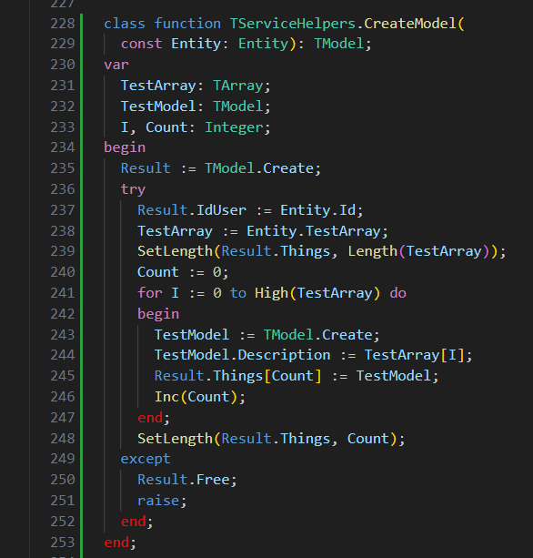

# Pascal Language Basics

This extension provides syntax highlighting for Object Pascal code. It is built upon an existing extension: [Pascal Language Basics](https://github.com/AnsonYeung/vscode-pascal-language-basics). Pascal Language Basics does not support Object Pascal, therefore we decided to fork it and add the necessary support in this extension.

## Features

Provides syntax highlighting for Object Pascal code.

- Classes
- Functions
- Keywords
- Properties
- Arrays
- Interfaces
- Types
- The 'Result' is set as a keyword to highlight what function returns.
- Recognize T-prefix to denote structured types.
- Recognize I-prefix to denote interfaces, e.g. IInterface.
<!-- TODO -->
<!-- - Recognize F-prefix to denote private field in a class or record -->
<!-- - Recognize mm-prefix to denote Enumeration members have a 2 char prefix e.g. fsBold, fsItalic for the TFontStyle enum. -->

## Feature Requests

This extension is far from perfect but we are open to suggestions and improvement ideas. If you have a feature request or questions open up a ticket in our GitHub.

## [Release Notes](CHANGELOG.md)
